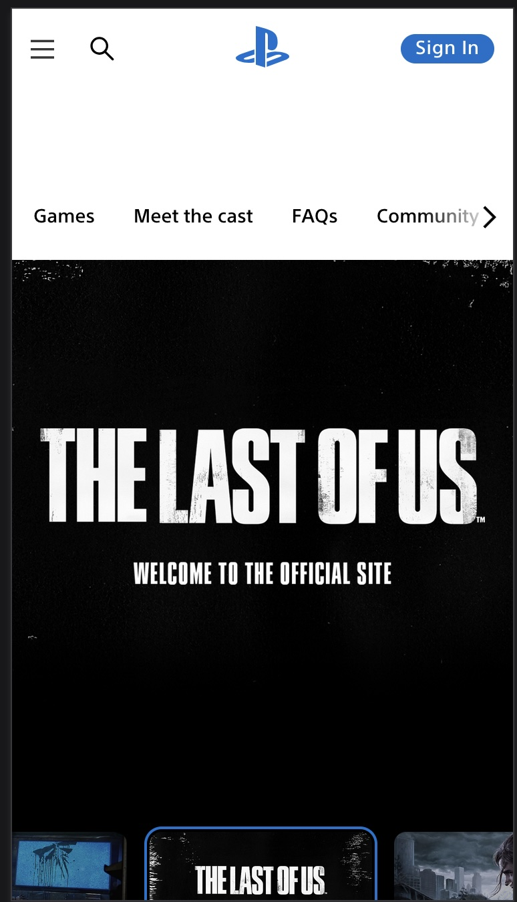
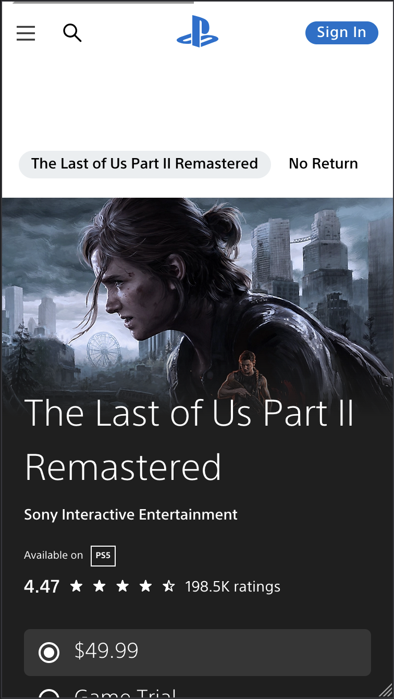
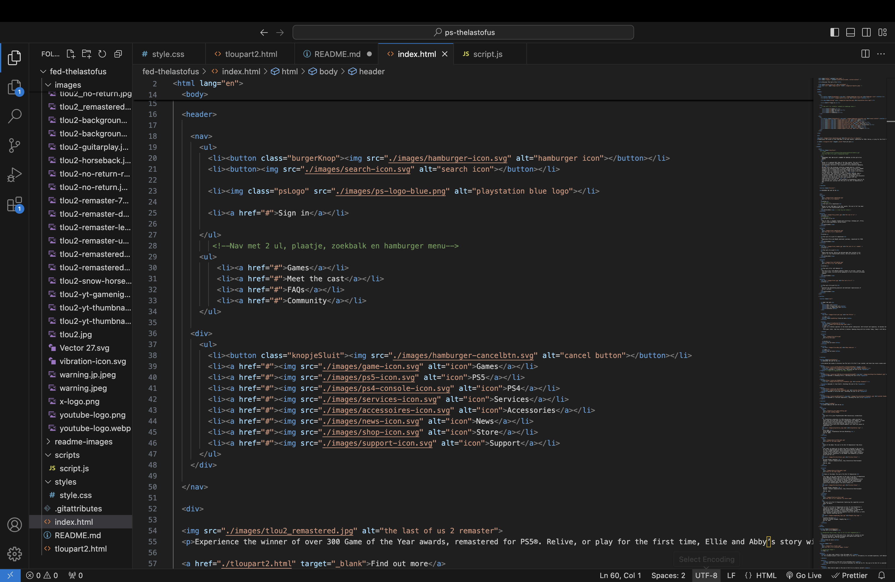

# Procesverslag
Markdown is een simpele manier om HTML te schrijven.  
Markdown cheat cheet: [Hulp bij het schrijven van Markdown](https://github.com/adam-p/markdown-here/wiki/Markdown-Cheatsheet).

Nb. De standaardstructuur en de spartaanse opmaak van de README.md zijn helemaal prima. Het gaat om de inhoud van je procesverslag. Besteedt de tijd voor pracht en praal aan je website.

Nb. Door *open* toe te voegen aan een *details* element kun je deze standaard open zetten. Fijn om dat steeds voor de relevante stuk(ken) te doen.

## Jij

  
uitwerken voor kick-off werkgroep

  ### Auteur:
  Marieke Derks

  #### Je startniveau:
  rood 

  #### Je focus:
  responsive
 

## Je website

  
uitwerken voor kick-off werkgroep

  ### Je opdracht:
  link naar de website die je gaat namaken óf de naam/omschrijving van je eigen ontwerp:
  
  Ik wil de playstation website namaken, hierin wil ik de home en de the last of us detail pagina maken.

  link:
  the last of us official site: https://www.playstation.com/nl-nl/the-last-of-us/

  detail pagina tlou2 remaster: https://www.playstation.com/nl-nl/games/the-last-of-us-part-ii-remastered/

  #### Screenshot(s) van de eerste pagina (small screen): 
  ontdek the last of us
  

  #### Screenshot(s) van de tweede pagina (small screen):
  the last of us 2 remaster detail
  
 

## Toegankelijkheidstest 1/2 (week 1)

  
uitwerken na test in 2e werkgroep

  ### Bevindingen
  Lijst met je bevindingen die in de test naar voren kwamen:

  Slechte motoriek: getest door vingers vast te binden
  -> Over het algemeen is de website nog steeds te gebruiken als de middelvinger en wijsvinger aan elkaar verbonden zijn.
  -> touchpad is hierin beschikbaar en op mobiel is het vooral scorllen en klikken en op deze wijze wordt je daarin niet veel beperkt.
  -> toetsenbord voor navigatie is ook beschikbaar.

  Spasmes/Parkinsons: 
  -> Muis/touchpad niet goed bruikbaar, dit gaat erg moeizaam. 
  -> Verschillende toetsen wel bruikbaar in het navigeren van de website. 
  -> Dit ligt er wel aan hoe heftig de spieren trekken want opgegeven moment was het voor mij vrijn lastig om überhaupt te functioneren.
  Dit misschien omdat ik hierin ook geen levenservaring heb.

  Zicht: getest aan de hand van verschillende brilletjes die het zicht beperken
  -> door verschillende brilletjes was de website voor een groot deel nog toegankelijk, de belangrijkste elementen waren over het algemeen nog in beeld.
  ->Er is tekst met laag contrast of onvoldoende vergrotingsopties en kan moeilijk leesbaar zijn.
  -> Kleurenblindheid kan problemen veroorzaken als de kleur de enige manier is om informatie over te brengen

  Concentratie
  -> De site bevat visueel drukke elementen zoals dynamische afbeeldingen en video's 
  -> Geen opties zoals vereenvoudige weergave of 'focusmodus'
  -> De navigatie is een beetje complex door dat je scrolt door een paar opties en de andere website navigatie in een hamburger ziiten (op mobiel).
  

## Breakdownschets (week 1)

  
uitwerken na afloop 3e werkgroep

  ### de hele pagina: 
  

  ### de tweede pagina
  

  ### dynamisch deel (bijv menu): 
  

  ### wellicht nog een dynamisch deel (bijv filter): 
  

## Voortgang 1 (week 2)

  
uitwerken voor 1e voortgang

  ### Stand van zaken
  Over het algemeen ging het goed met html opzetten van de pagina's. Ik merkte wel in het gesprek dat
  ik soms slordigheids foutjes maakte zoals het vergeten van de header in de body plaatsen. Maar als je het mij vraagt komt dit vooral doordat ik weer even moest opstarten met code. 

  

  Ook heb ik een paar tips gekregen over hoe ik mijn navigatie kan aanpakken en heb ik dit gelijk toegpast. Namelijk meerdere ul's gebruiken in de navigatie. 

  ### Agenda voor meeting
  samen met je groepje opstellen

  | student 1      | student 2          | student 3    | student 4        |
  | ---            | ---                | ---          | ---              |
  | dit bespreken  | en dit             | en ik dit    | en dan ik dat    |
  | en dat ook nog | dit als er tijd is | nog een punt | dit wil ik zeker |
  | ...            | ...                | ...          | ...              |

  ### Verslag van meeting
  hier na afloop snel de uitkomsten van de meeting vastleggen

  - Header in body zetten
  - Gebruik maken van details (nieuwe html tag)
  - Paar kleine detail foutjes in html verbeteren
  - Twee UL's in Navigation maken
  - Kiezen welke micro-interaction je gaat focussen

## Voortgang 2 (week 3)

  
uitwerken voor 2e voortgang

  ### Stand van zaken
  hier dit ging goed & dit was lastig (neem ook screenshots op van delen van je website en code)

  ### Agenda voor meeting
  samen met je groepje opstellen

  | Marieke        | Berend             | Fatima       | Anko             |
  | ---            | ---                | ---          | ---              |
  | dit bespreken  | en dit             | en ik dit    | en dan ik dat    |
  | en dat ook nog | dit als er tijd is | nog een punt | dit wil ik zeker |
  | ...            | ...                | ...          | ...              |

  -> Efficient css
  -> Waar mag ik classes gebruiken en hoeveel? (sections of body?)
  -> Instagram feed in html
  -> In hoeverre moet ik alles uitwerken
  -> Font gaat niet naar github + sommige plaatjes

  ### Verslag van meeting
  hier na afloop snel de uitkomsten van de meeting vastleggen

  - nav tweede pagina is anders (heeft maar 2 li's)
  - ds-store kan weg 
  - nav button class weghalen
  - Section en articles altijd beginnen met heading en van plaats wisselen met order
  - width in html weg halen
  - goed beargumenteren waarom wel divs en classes
  - 1 carrousel uitwerken en hamburger menu (carrousel in t begin)
  - button hover niet vergeten
  - consistent em en px gebruik? 

## Toegankelijkheidstest 2/2 (week 4)

  
uitwerken na test in 9e werkgroep

  ### Bevindingen
  Lijst met je bevindingen die in de test naar voren kwamen (geef ook aan wat er verbeterd is):

## Voortgang 3 (week 4)

  
uitwerken voor 3e voortgang

  ### Stand van zaken
  hier dit ging goed & dit was lastig (neem ook screenshots op van delen van je website en code)

  ### Agenda voor meeting
  samen met je groepje opstellen

  | student 1      | student 2          | student 3    | student 4        |
  | ---            | ---                | ---          | ---              |
  | dit bespreken  | en dit             | en ik dit    | en dan ik dat    |
  | en dat ook nog | dit als er tijd is | nog een punt | dit wil ik zeker |
  | ...            | ...                | ...          | ...              |

Vragen:
  -> section en articles beginnen met heading & switchen met order??
  -> kan ik < br > gebruiken?
  -> hamburger en dialog genoeg aan micro-interactions?
  -> language reader niet correct?
  -> div gebruiken om de dialog om sluit knopje er boven te zetten? Is dit responsief lief?
  -> is mijn toegankelijkheids test uitgebreid genoeg (?)

  ### Verslag van meeting
  hier na afloop snel de uitkomsten van de meeting vastleggen

  - punt 1
  - punt 2
  - nog een punt
  - ...

## Eindgesprek (week 5)

  
uitwerken voor eindgesprek

  ### Je uitkomst - karakteristiek screenshots:
  

  ### Dit ging goed/Heb ik geleerd: 
  Korte omschrijving met plaatjes

  

  ### Dit was lastig/Is niet gelukt:
  Korte omschrijving met plaatjes

  

## Bronnenlijst

  
continu bijhouden terwijl je werkt

  Nb. Wees specifiek ('css-tricks' als bron is bijv. niet specifiek genoeg). 
  Nb. ChatGpT en andere AI horen er ook bij.
  Nb. Vermeld de bronnen ook in je code.

  1. bron 1: MDN: breadcrumps navigation (https://developer.mozilla.org/en-US/docs/Web/CSS/Layout_cookbook/Breadcrumb_Navigation)
  2. bron 2
  3. ...

