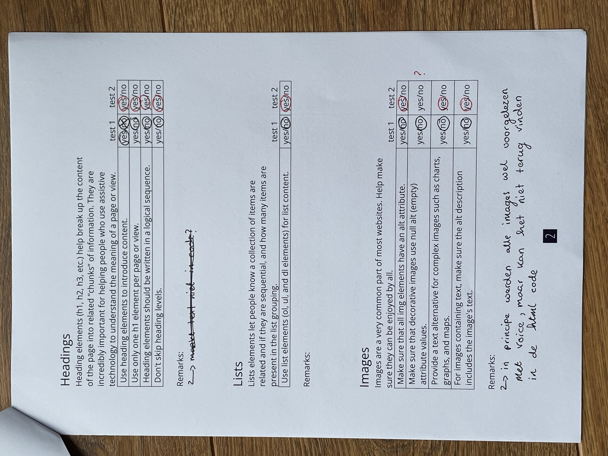

# Procesverslag
Markdown is een simpele manier om HTML te schrijven.  
Markdown cheat cheet: [Hulp bij het schrijven van Markdown](https://github.com/adam-p/markdown-here/wiki/Markdown-Cheatsheet).

Nb. De standaardstructuur en de spartaanse opmaak van de README.md zijn helemaal prima. Het gaat om de inhoud van je procesverslag. Besteedt de tijd voor pracht en praal aan je website.

Nb. Door *open* toe te voegen aan een *details* element kun je deze standaard open zetten. Fijn om dat steeds voor de relevante stuk(ken) te doen.

## Jij

  
uitwerken voor kick-off werkgroep

  ### Auteur:
  Marieke Derks

  #### Je startniveau:
  rood 

  #### Je focus:
  responsive
 

## Je website

  
uitwerken voor kick-off werkgroep

  ### Je opdracht:
  link naar de website die je gaat namaken óf de naam/omschrijving van je eigen ontwerp:
  
  Ik wil de playstation website namaken, hierin wil ik de home en de the last of us detail pagina maken.

  link:
  the last of us official site: https://www.playstation.com/nl-nl/the-last-of-us/

  detail pagina tlou2 remaster: https://www.playstation.com/nl-nl/games/the-last-of-us-part-ii-remastered/

  #### Screenshot(s) van de eerste pagina (small screen): 
  ontdek the last of us
  

  #### Screenshot(s) van de tweede pagina (small screen):
  the last of us 2 remaster detail
  
 

## Toegankelijkheidstest 1/2 (week 1)

  
uitwerken na test in 2e werkgroep

  ### Bevindingen
  Lijst met je bevindingen die in de test naar voren kwamen:

  Slechte motoriek: getest door vingers vast te binden
  -> Over het algemeen is de website nog steeds te gebruiken als de middelvinger en wijsvinger aan elkaar verbonden zijn.
  -> touchpad is hierin beschikbaar en op mobiel is het vooral scorllen en klikken en op deze wijze wordt je daarin niet veel beperkt.
  -> toetsenbord voor navigatie is ook beschikbaar.

  Spasmes/Parkinsons: 
  -> Muis/touchpad niet goed bruikbaar, dit gaat erg moeizaam. Dit komt vooral van de vele plotselinge bewegingen die je maakt wat er voor zorgt dat het gebruiken van ee muis heel lastig gaat. Een muis is te precies werk.
  -> Verschillende toetsen wel bruikbaar in het navigeren van de website. 
  -> Dit ligt er wel aan hoe heftig de spieren trekken want opgegeven moment was het voor mij vrij lastig om überhaupt te functioneren.
  Dit misschien omdat ik hierin ook geen levenservaring heb.

  Zicht: getest aan de hand van verschillende brilletjes die het zicht beperken
  -> door verschillende brilletjes was de website voor een groot deel nog toegankelijk, de belangrijkste elementen waren over het algemeen nog in beeld.
  ->Er is tekst met laag contrast of onvoldoende vergrotingsopties en kan moeilijk leesbaar zijn.
  -> Kleurenblindheid kan problemen veroorzaken als de kleur de enige manier is om informatie over te brengen.

  Concentratie
  -> De site bevat visueel drukke elementen zoals dynamische afbeeldingen en video's zoals veel carrousels die uit zich zelf bewegen en wisselen van plaatje. 
  -> Geen opties zoals vereenvoudige weergave of 'focusmodus'
  -> De navigatie is een beetje complex door dat je scrolt door een paar opties en de andere website navigatie in een hamburger ziiten (op mobiel).
  

## Breakdownschets (week 1)

  
uitwerken na afloop 3e werkgroep

  ### de hele pagina: 
  

  ### de tweede pagina
  

## Voortgang 1 (week 2)

  
uitwerken voor 1e voortgang

  ### Stand van zaken
  Over het algemeen ging het goed met html opzetten van de pagina's. Ik merkte wel in het gesprek dat
  ik soms slordigheids foutjes maakte zoals het vergeten van de header in de body plaatsen. Maar als je het mij vraagt komt dit vooral doordat ik weer even moest opstarten met code. 

  

  Ook heb ik een paar tips gekregen over hoe ik mijn navigatie kan aanpakken en heb ik dit gelijk toegpast. Namelijk meerdere ul's gebruiken in de navigatie. 

  ### Agenda voor meeting
  samen met je groepje opstellen

  | Marieke        | Berend             | Anko         | Fatima           |
  | ---            | ---                | ---          | ---              |
  | dit bespreken  | en dit             | en ik dit    | en dan ik dat    |
  | en dat ook nog | dit als er tijd is | nog een punt | dit wil ik zeker |
  | ...            | ...                | ...          | ...              |

  ### Verslag van meeting
  hier na afloop snel de uitkomsten van de meeting vastleggen

  - Header in body zetten
  - Gebruik maken van details (nieuwe html tag)
  - Paar kleine detail foutjes in html verbeteren
  - Twee UL's in Navigation maken
  - Kiezen welke micro-interaction je gaat focussen

## Voortgang 2 (week 3)

  
uitwerken voor 2e voortgang

  ### Stand van zaken
  Dit gesprek liep prima en heel soepeltjes. Ik heb mijn vragen kunnen stellen en hieruit weer nieuwe inzichten gekregen waarmee ik door kan werken. Ik ben bijna klaar met alle CSS. De tweede pagina heeft nog een paar dingetejs nodig en dan kan ik beginnen aan responsive.

  ### Agenda voor meeting
  samen met je groepje opstellen

  | Marieke        | Berend             | Fatima       | Anko             |
  | ---            | ---                | ---          | ---              |
  | dit bespreken  | en dit             | en ik dit    | en dan ik dat    |
  | en dat ook nog | dit als er tijd is | nog een punt | dit wil ik zeker |
  | ...            | ...                | ...          | ...              |

  -> Efficient css
  -> Waar mag ik classes gebruiken en hoeveel? (sections of body?)
  -> Instagram feed in html
  -> In hoeverre moet ik alles uitwerken
  -> Font gaat niet naar github + sommige plaatjes

  ### Verslag van meeting
  hier na afloop snel de uitkomsten van de meeting vastleggen

  - nav tweede pagina is anders (heeft maar 2 li's)
  - ds-store kan weg 
  - nav button class weghalen
  - Section en articles altijd beginnen met heading en van plaats wisselen met order
  - width in html weg halen
  - goed beargumenteren waarom wel divs en classes
  - 1 carrousel uitwerken en hamburger menu (carrousel in t begin)
  - button hover niet vergeten
  - consistent em en px gebruik? 

## Toegankelijkheidstest 2/2 (week 4)

  
uitwerken na test in 9e werkgroep

  ### Bevindingen
  Lijst met je bevindingen die in de test naar voren kwamen (geef ook aan wat er verbeterd is):

  
  
  
  
  

  Over het algemeen moet ik wel zeggen dat ik de eerste keer deze toegankelijkheids lijst bij heel veel punten niet heb begrepen. Hierdoor zijn sommige opties in de eerste test verkeerd aangekruist. 

  Wat ik beter heb gedaan dan de officiele site is het gebruik maken van een semantisch correcte html structuur met de juiste heading elementen, sections en images met alt tributen. Ook heb ik hierin op de juiste manier gebruik gemaakt van button's en linkjes. Bij de officiele site was niet goed te detecteren wat ze daarmee hadden gedaan.
  Ook heb ik dark-mode toegevoegd. Dit is niet aangekruisd bij de tweede test maar des tijds toen ik em invulde had ik deze nog niet. 

## Voortgang 3 (week 4)

  
uitwerken voor 3e voortgang

  ### Stand van zaken
  Ik had voor mijn laatste voortgang gesprek veel vraagjes. Alle zijn goed beantwoord waardoor ik mijn website nu goed kan afronden. Ik merk wel dat ondanks ik een heel eind ben, dat er nog wel een paar dingen zijn die ik moet doen. Ik weet niet of ik alle nieuwe tips uiteindelijk kan toepassen vanwege tijdsgebrek maar ik ga hierin mijn best doen!

  hier dit ging goed & dit was lastig (neem ook screenshots op van delen van je website en code)

  ### Agenda voor meeting
  samen met je groepje opstellen

  | student 1      | student 2          | student 3    | student 4        |
  | ---            | ---                | ---          | ---              |
  | dit bespreken  | en dit             | en ik dit    | en dan ik dat    |
  | en dat ook nog | dit als er tijd is | nog een punt | dit wil ik zeker |
  | ...            | ...                | ...          | ...              |

Vragen:
  -> section en articles beginnen met heading & switchen met order??
  -> kan ik < br > gebruiken?
  -> hamburger en dialog genoeg aan micro-interactions?
  -> language reader niet correct?
  -> div gebruiken om de dialog om sluit knopje er boven te zetten? Is dit responsief lief?
  -> is mijn toegankelijkheids test uitgebreid genoeg (?)

  ### Verslag van meeting
  hier na afloop snel de uitkomsten van de meeting vastleggen

  -> Sections en articles hoeven niet te beginnen met header (DONE)
  -> Geen br gebruiken!! Verschillende p elementen toepassen en margin gebruiken! (DONE)
  -> hamburger menu en dialog zijn genoeg qua interacties! (DONE)
  -> transform Y gebruiken op sluit knop -> dialog (overflow: show)
  -> toegankelijkheids test even iets meer voorbeelden geven 
  -> gebruik active states voor buttons en section meet the cast! (hoeft nie verder uitgewerkt)
  -> zo min mogelijk media queries -> maak gebruik van grid auto fit 
  -> picture element gebruiken voor verschillende images op verschillende widths 
  -> tablet formaat verbeteren waar nodig is (min-widt: 756 px?)
  -> Screenshots toegankelijkheid toevoegen in proces verslag!

  andere to-do's:
  - hover states niet vergeten! (DONE)
  - Faq details opleuken (DONE)
  - footer responsive! (DONE)
  - dialogs toevoegen! (DONE)
  - 
  
  - nav fixen tweede pagina (DONE)
  - Darkmode!!! (DONE)
  - responsive 2de pagina (DONE)

## Eindgesprek (week 5)

  
uitwerken voor eindgesprek

  ### Je uitkomst - karakteristiek screenshots:
  

  ### Dit ging goed/Heb ik geleerd: 
  Korte omschrijving met plaatjes

  
  

  Ik heb bij deze opdracht geleerd hoe ik grid kan gebruiken en tegelijkertijd mijn site responsive maak. Ik heb in het eerste jaar altijd een beetje moeite gehad met het positioneren van dingen dus ik heb me in deze opdracht juist heel erg gefocust op dit gebied. Ook wilde ik dolsgraag leren responsive maken omdat ik ook nog nooit in aanraking ben geweest met media queries. Ik vind dat dit voor mijn eerste keer een echte website bouwen met deze nieuwe elementen dat dit me best goed is gelukt en daar ben ik wel trots op.

  ### Dit was lastig/Is niet gelukt:
  Korte omschrijving met plaatjes

  Mijn puntje om in te ontwikkelen is om met structuur te gaan coderen. Ik heb bij dit project best wel vaak ruzie gehad met mijn eigen code omdat ik dan perongeluk elementen aan t overschrijven was etc. Ook had ik vanaf het begin mijn website die ik ging namaken nog beter moeten analyseren omdat ik in eerste instantie soms stappen heb overgeslagen of heb overzien waardoor het lastiger was om die last-minute nog toe te voegen.

  Hierbij heb ik als voorbeeld: het hamburger menu. Deze werkt wel en is te zien op klein formaat. Zodra de width voorbij 1024px gaat zal deze optie verdwijnen. Alleen zouden deze navigatie knoppen wel nog in de nav moeten verschijnen, ik ben dit helemaal vergeten te verwerken en kwam hier op het laatst pas achter. Dit is mij uiteindelijk ook niet meer gelukt. Ik heb het geprobeerd op te lossen in een kopie bestand maar het lukte me niet meer ik zat in tijdsnood. 

  Ik vind dit achteraf gezien wel jammer, ik denk dat dit wel was gelukt als ik dit vanaf het begin had mee bedacht.

  

  Ook als ik meer tijd had gehad had ik gebruik willen maken van clamps (ik weet nie zeker of deze hadden geholpen) om mijn fonts op verschillende formaten uitzich aan te late passen. Zo zijn er wel meer dingetjes die ik niet meer heb kunnen verwerken vanwege te weinig tijd. 

## Bronnenlijst

  
continu bijhouden terwijl je werkt

  Nb. Wees specifiek ('css-tricks' als bron is bijv. niet specifiek genoeg). 
  Nb. ChatGpT en andere AI horen er ook bij.
  Nb. Vermeld de bronnen ook in je code.

  1. bron 1: MDN: breadcrumps navigation (https://developer.mozilla.org/en-US/docs/Web/CSS/Layout_cookbook/Breadcrumb_Navigation)
  2. bron 2: Chatgpt voor NO-SCROLL op body in de hamburger menu. (gevraagd hoe ik dit het beste kan oplossen) (ik heb de chat niet meer :/ maar chatgpt heeft de body scroll voor mij geschreven)
  3. bron 3: Soms grid gemaakt met behulp van https://cssgrid-generator.netlify.app/ !!
  4. Hulp van mede studenten :D

